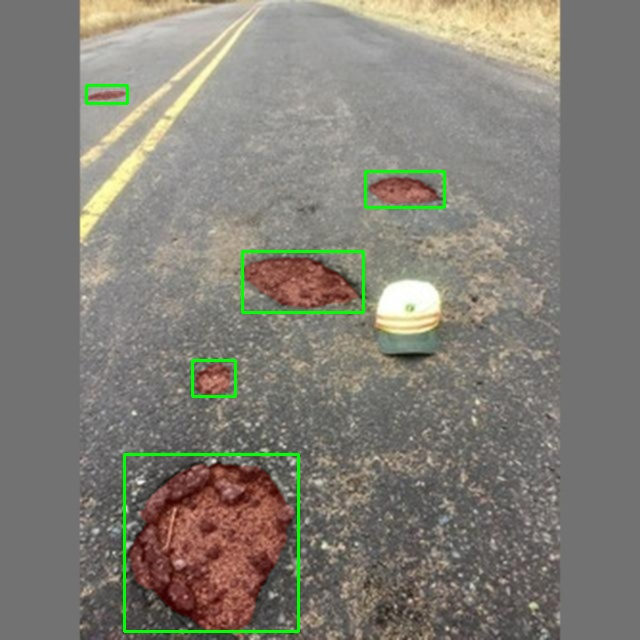
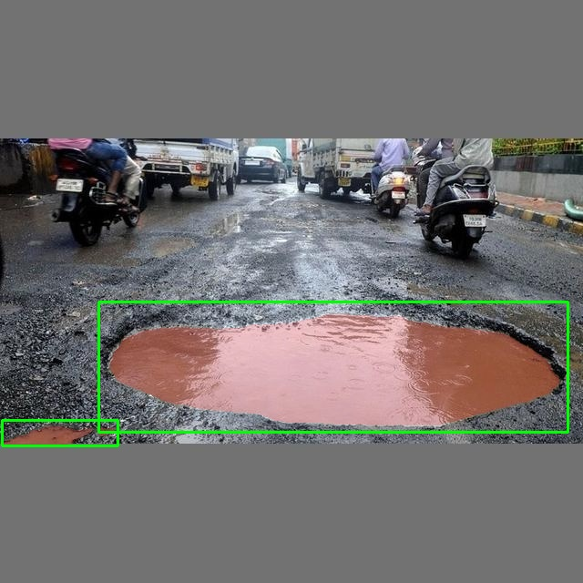
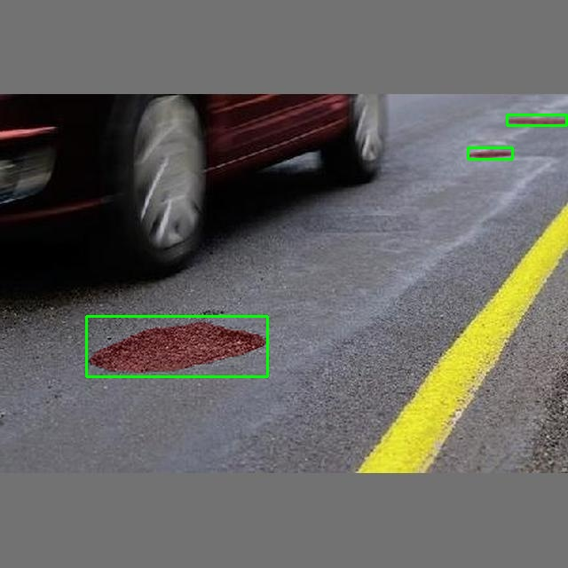
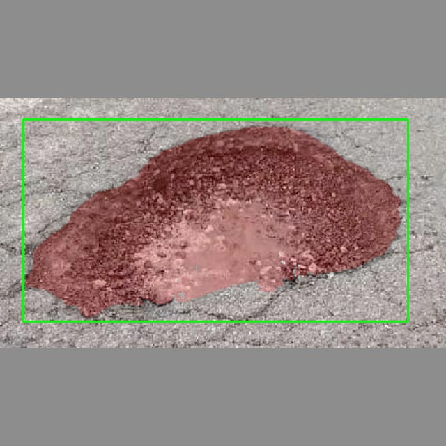
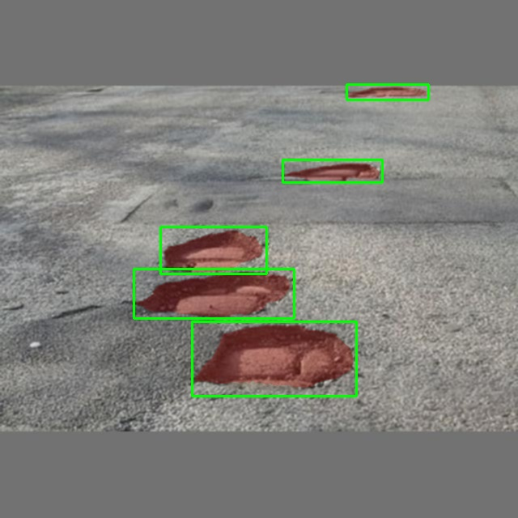
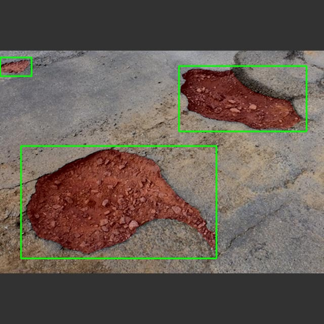
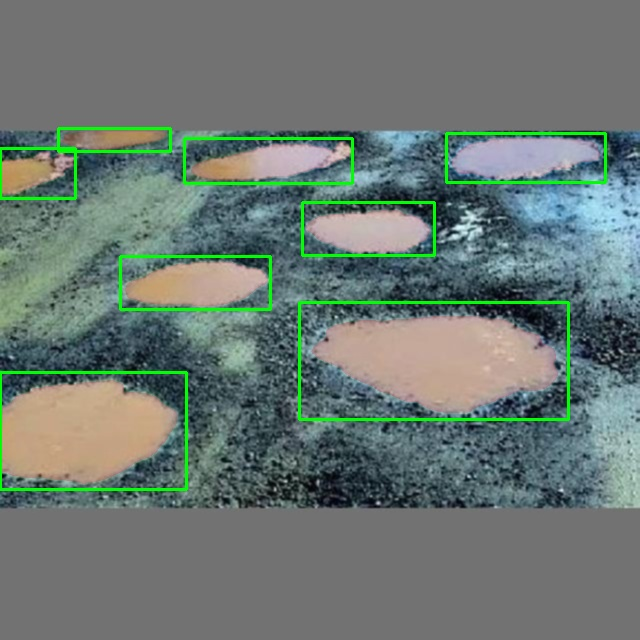
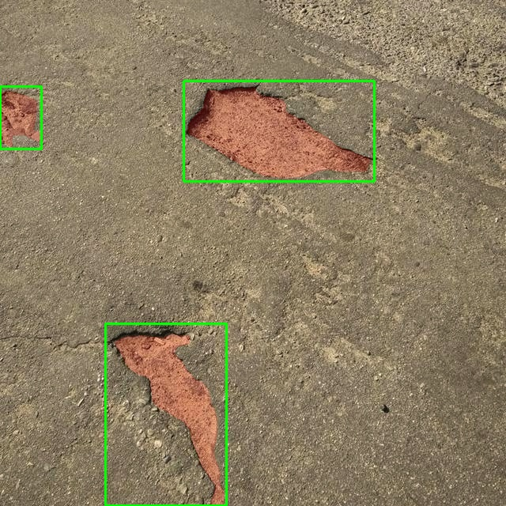
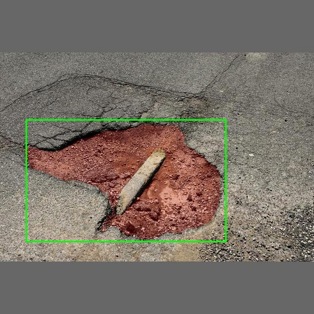
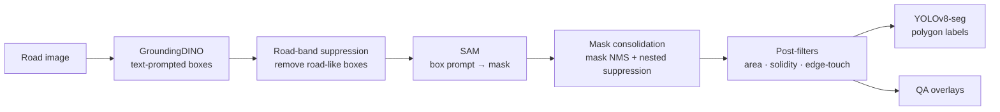

# PaveX Auto-Annotation

**Automatic pixel-level annotation of pothole images using GroundingDINO + Segment Anything (SAM), exported in YOLOv8-seg format.**

Manually drawing polygon masks for road defects takes several minutes per image and does not scale. This project builds an **inference-only** pipeline that turns raw road images into YOLOv8-seg training labels with no manual polygon drawing. It combines pretrained foundation models (no fine-tuning) with domain-informed filtering rules.

<!-- > 📄 This repository accompanies the paper *"Automatic Annotation of Pothole Images Using GroundingDINO and Segment Anything for YOLOv8 Segmentation"* (CDSR 2026). TODO: add paper link / DOI once available -->

<p align="center">
  
  
  
  
  
  
  
  
  
</p>
<p align="center"><em>Green: GroundingDINO boxes · Red: SAM masks after filtering</em></p>

---

## Pipeline



| Stage | What it does | Why it exists |
|---|---|---|
| 1. Box proposal | GroundingDINO detects regions matching pothole-related text prompts | Zero-shot localisation, no training needed |
| 2. Road-band suppression | Removes boxes that span the image edge-to-edge or cover ≥ 75% of it | GroundingDINO often labels the whole road surface as a "pothole" |
| 3. Segmentation | Each remaining box is sent to SAM as a box-only prompt | Box prompts give more stable masks than point prompts |
| 4. Consolidation | Mask-level NMS and nested-mask suppression | Removes duplicate and overlapping masks |
| 5. Post-filters | Drops masks that are too small, too large, low-solidity, or large and border-touching | Rejects geometrically implausible regions |
| 6. Export | Largest contour → simplified polygon → normalised YOLOv8-seg label | Direct input for YOLOv8-seg training |

### Configuration (paper, Table 2)

| Parameter | Value | Parameter | Value |
|---|---|---|---|
| Prompts | `potholes`, `pothole`, `road pothole`, `asphalt hole` | Mask NMS IoU | 0.70 |
| `BOX_THR` | 0.24 | Min mask area | 200 px |
| Box `NMS_THR` | 0.33 | Max mask area fraction | 0.50 |
| Edge margin | 2% | Min solidity | 0.60 |
| Road-band min area / height / width | 0.20 / 0.30 / 0.30 | Edge rule (area gate / edges) | 0.40 / ≥ 3 |
| Huge-box area | 0.75 | Polygon simplification ε | 1.5 px |
| SAM backbone | ViT-H | Min contour area | 10 px |

Values are read from `configs/pipeline_config.json` and `configs/seed_input.json`. `pipeline_config.json` also contains settings from an earlier exploratory pipeline (manhole gate, likelihood scoring, refinement) that the notebook does not use.

---

## Results

Evaluated on an independent, manually annotated **200-image** ground-truth subset (greedy one-to-one instance matching at mask IoU ≥ 0.5).

| Metric | Value |
|---|---|
| True Positives | 241 |
| False Positives | 131 |
| False Negatives | 24 |
| Precision | 0.648 |
| **Recall** | **0.909** |
| Mean IoU (matched only) | 0.838 |
| Mean Dice (matched only) | 0.907 |

The pipeline is intentionally **recall-first**. For dataset construction, a missed pothole is permanently lost supervision, whereas a false positive can be removed in a quick accept/reject screening pass. Re-runs may differ slightly in exact counts because of GPU non-determinism and library versions; see [`results/`](results/).

---

## Repository structure

```
pavex-autoannotation/
├── README.md
├── LICENSE
├── requirements.txt              # locked versions
├── .gitignore
├── notebooks/
│   └── fullexportrun.ipynb       # full pipeline: config → models → auto-annotate → evaluate
├── configs/
│   ├── pipeline_config.json      # model IDs, prompts, thresholds, post-filters
│   ├── seed_input.json           # post-filter overrides (min area, max area, solidity)
│   └── paths.example.json        # template for your local paths
├── results/
│   ├── README.md
│   └── seg_eval_summary.json
└── docs/images/                  # example overlays
```

Data and model weights are **not** stored in this repository.

---

## Getting started

### 1. Download the SAM weights

- **SAM ViT-H:** [`sam_vit_h_4b8939.pth`](https://dl.fbaipublicfiles.com/segment_anything/sam_vit_h_4b8939.pth) (~2.4 GB) from [Meta's Segment Anything repo](https://github.com/facebookresearch/segment-anything)
- **GroundingDINO** (`IDEA-Research/grounding-dino-base`) downloads automatically from Hugging Face on first run.

### 2a. Run on Google Colab (GPU recommended)

1. Open `notebooks/fullexportrun.ipynb` in Colab and select **Runtime → Change runtime type → T4 GPU**.
2. Place the config files, SAM weights, images and ground-truth labels on Google Drive, and set the folders in the **Colab section of Cell 0**.
3. Run all cells. Dependencies install automatically.

### 2b. Run locally (Windows, Python 3.12)

```bat
py -V:3.12 -m venv .venv
.venv\Scripts\python.exe -m pip install -r requirements.txt ipykernel
```

1. Copy `configs/paths.example.json` to `configs/paths.local.json` and set your folders. The default layout keeps data next to the repo:
   ```
   PaveX/
   ├── pavex-autoannotation/     ← this repository
   └── pavex-data/
       ├── images/               images to auto-annotate
       ├── originals/            original images for evaluation (img_XXXX.jpg)
       ├── labels_gt/            ground-truth YOLOv8-seg labels
       ├── models/               sam_vit_h_4b8939.pth
       └── runs/                 created by the notebook
   ```
2. Open the notebook in VS Code, select the `.venv` kernel and run all cells.

Without an NVIDIA GPU, set `MAX_IMAGES = 5` in Cell 0 for a quick test (~50 s per image on CPU).

### Run settings (Cell 0)

| Setting | Purpose |
|---|---|
| `RUN_ANNOTATE` | Auto-annotate every image in `images_dir` |
| `RUN_EVAL` | Evaluate on the ground-truth subset |
| `MAX_IMAGES` | Limit the number of images (e.g. `5` for a test); `None` = all |
| `SKIP_EXISTING` | Resume an interrupted run (set `RUN_NAME` to that run's folder) |

### Outputs

Each run gets its own folder, `runs/run_<timestamp>/`:

| Output | Contents |
|---|---|
| `labels_pred_seg/` | YOLOv8-seg labels (`cls x1 y1 … xn yn`), one `.txt` per image |
| `overlays_all_seg/`, `overlays_seg_eval/` | QA overlays |
| `eval/` | `seg_eval_summary.json` and `seg_eval_per_image.csv` |
| `pipeline_config.json`, `seed_input.json`, `run_info.json` | Configuration and environment used for the run |

Runtime is about 3.5 s per image on a Colab T4 GPU.

---

## Dataset

Images were collected from 14 public Kaggle datasets (11,759 raw images), then cleaned by removing sequential dashcam frames, perceptual-hash near-duplicates (hash size 16), blurry images (Laplacian variance < 100), and irrelevant scenes. **2,366 images** remained.

Images are **not redistributed** here. Each source has its own license; please obtain them from the original pages:

[1](https://www.kaggle.com/datasets/atulyakumar98/pothole-detection-dataset) ·
[2](https://www.kaggle.com/datasets/andrewmvd/pothole-detection) ·
[3](https://www.kaggle.com/datasets/virenbr11/pothole-and-plain-rode-images) ·
[4](https://www.kaggle.com/datasets/sachinpatel21/pothole-image-dataset) ·
[5](https://www.kaggle.com/datasets/idanbaru/annotated-potholes-with-severity-levels) ·
[6](https://www.kaggle.com/datasets/ashishkumarak/test-zip) ·
[7](https://www.kaggle.com/datasets/virenbr11/pothole-detection-small) ·
[8](https://www.kaggle.com/datasets/jiahangli617/udtiri) ·
[9](https://www.kaggle.com/datasets/hosen42/pothole-data) ·
[10](https://www.kaggle.com/code/satyaprakashshukl/pothole-detection/input) ·
[11](https://www.kaggle.com/datasets/gauravduttakiit/pothole-detection) ·
[12](https://www.kaggle.com/datasets/sovitrath/road-pothole-images-for-pothole-detection) ·
[13](https://www.kaggle.com/datasets/banilkumar20phd7071/pothole-and-normal-road-pavement-augmented-data) ·
[14](https://www.kaggle.com/datasets/gauravduttakiit/pothole-detection-using-ml)

<!-- ---

## Notes

- **Code updates after the paper:** YOLOv8-seg labels are now written polygon-only; nested-mask suppression uses containment; masks and boxes stay aligned through all filters. The notebook also runs locally as well as on Colab.
- The prompts are joined as in the original experiments (`"potholes. . pothole. . …"`); this is kept for comparability.

--- -->

## Built with

[GroundingDINO](https://github.com/IDEA-Research/GroundingDINO) (via 🤗 Transformers) ·
[Segment Anything](https://github.com/facebookresearch/segment-anything) ·
[OpenCV](https://opencv.org/) ·
[Ultralytics YOLOv8](https://github.com/ultralytics/ultralytics) (downstream training)

<!-- ## Authors

NM Salleh, Yun Xi Ang, Wen Lin Ching, Joey Zhu Yi Ng, Rui Xi Koh, Jia Yin Lim, Yi Ning Tee
Sunway Business School, Sunway University, Malaysia

## Citation

```bibtex
@inproceedings{pavex2026autoannotation,
  title     = {Automatic Annotation of Pothole Images Using GroundingDINO and Segment Anything for YOLOv8 Segmentation},
  author    = {Salleh, N. M. and Ang, Yun Xi and Ching, Wen Lin and Ng, Joey Zhu Yi and Koh, Rui Xi and Lim, Jia Yin and Tee, Yi Ning},
  booktitle = {Proceedings of the 13th International Conference of Control Systems, and Robotics (CDSR)},
  year      = {2026},
  address   = {Barcelona, Spain}
}
``` -->

## License

Code is released under the [Apache License 2.0](LICENSE). Model weights and datasets are subject to their original licenses.
