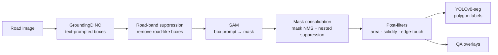

# PaveX Auto-Annotation

**Automatic pixel-level annotation of pothole images using GroundingDINO + Segment Anything (SAM), exported in YOLOv8-seg format.**

Manually drawing polygon masks for road defects takes several minutes per image and does not scale. This project builds an **inference-only** pipeline that turns raw road images into YOLOv8-seg training labels with no manual polygon drawing. It uses pretrained foundation models (no fine-tuning) combined with domain-informed filtering rules.

> 📄 This repository accompanies the paper *"Automatic Annotation of Pothole Images Using GroundingDINO and Segment Anything for YOLOv8 Segmentation"* (CDSR 2026). <!-- TODO: add paper link / DOI once available -->


<p align="center">
  
  
  
  
  
  

</p>
<p align="center"><em>Green: GroundingDINO boxes · Red: SAM masks after filtering</em></p>


---

## Pipeline



| Stage | What it does | Why it exists |
|---|---|---|
| 1. Box proposal | GroundingDINO detects regions matching pothole-related text prompts in one forward pass | Zero-shot localisation, no training needed |
| 2. Road-band suppression | Removes boxes that span the image edge-to-edge or cover ≥ 75% of it | GroundingDINO often labels the whole road surface as a "pothole" |
| 3. Segmentation | Each remaining box is sent to SAM as a box-only prompt (`multimask_output=False`) | Box prompts give more stable masks than point prompts |
| 4. Consolidation | Mask-level NMS and nested-mask suppression | Removes duplicate / overlapping masks |
| 5. Post-filters | Drops masks that are too small, too large, low-solidity, or large and border-touching | Rejects geometrically implausible regions |
| 6. Export | Largest contour → simplified polygon → normalised YOLOv8-seg label | Direct input for YOLOv8-seg training |

### Final configuration (paper, Table 2)

| Parameter | Value | Parameter | Value |
|---|---|---|---|
| Prompts | `potholes`, `pothole`, `road pothole`, `asphalt hole` | Mask NMS IoU | 0.70 |
| `BOX_THR` | 0.24 | Min mask area | 200 px |
| Box `NMS_THR` | 0.33 | Max mask area fraction | 0.50 |
| Edge margin | 2% | Min solidity | 0.60 |
| Road-band min area / height / width | 0.20 / 0.30 / 0.30 | Edge rule (area gate / edges) | 0.40 / ≥ 3 |
| Huge-box area | 0.75 | Polygon simplification ε | 1.5 px |
| SAM backbone | ViT-H | Min contour area | 10 px |

Runtime values are read from `configs/pipeline_config.json` and `configs/seed_input.json`.

---

## Results

Evaluated on an independent, manually annotated **200-image** ground-truth subset (instance matching at IoU ≥ 0.5, greedy one-to-one).

| Metric | Value |
|---|---|
| True Positives | 241 |
| False Positives | 131 |
| False Negatives | 24 |
| Precision | 0.648 |
| **Recall** | **0.909** |
| Mean IoU (matched only) | 0.838 |
| Mean Dice (matched only) | 0.907 |

The pipeline is intentionally **recall-first**. For dataset construction, a missed pothole is permanently lost supervision, whereas a false positive can be removed in a quick accept/reject screening pass. Raw outputs: [`results/seg_eval_summary.json`](results/seg_eval_summary.json), [`results/seg_eval_per_image.csv`](results/seg_eval_per_image.csv).

A downstream YOLOv8s-seg model trained on the screened auto-labels is reported in the paper (Table 7) as a usability check; its training code is not yet included in this repository.

---

## Repository structure

```
pavex-autoannotation/
├── README.md
├── LICENSE
├── requirements.txt
├── notebooks/
│   └── fullexportrun.ipynb       # full pipeline: load models → auto-annotate → evaluate
├── configs/
│   ├── pipeline_config.json      # model IDs, prompts, thresholds, post-filters
│   └── seed_input.json           # post-filter overrides (min area, solidity)
├── results/
│   ├── seg_eval_summary.json
│   └── seg_eval_per_image.csv
└── docs/images/                  # example overlays
```

---

## Getting started (Google Colab)

The notebook was developed on Google Colab with a GPU runtime.

**1. Get the model weights** (not stored in this repo):
- **SAM ViT-H**: download [`sam_vit_h_4b8939.pth`](https://dl.fbaipublicfiles.com/segment_anything/sam_vit_h_4b8939.pth) (~2.4 GB) from [Meta's Segment Anything repo](https://github.com/facebookresearch/segment-anything).
- **GroundingDINO**: `IDEA-Research/grounding-dino-base` downloads automatically from Hugging Face.

**2. Arrange your Google Drive** like this (paths are set in Cell 0 of the notebook):

```
My Drive/
├── pavex_bbox_experiments/exports/pavex_sam_seed_pack_v11b/
│   ├── pipeline_config.json      # copy from configs/
│   ├── seed_input.json           # copy from configs/
│   └── models/sam_vit_h_4b8939.pth
└── BigDataset/
    ├── augmented/                # input images (.jpg / .jpeg / .png)
    └── labels_gt/                # ground-truth YOLOv8-seg labels (for evaluation)
```

**3. Run the notebook.** Open `notebooks/fullexportrun.ipynb` in Colab, set **Runtime → Change runtime type → GPU**, then run all cells. Outputs are written to `BigDataset/runs_sam_refined_v11b_augmented/`:

| Folder / file | Contents |
|---|---|
| `labels_pred_seg/` | Auto-generated YOLOv8-seg labels (one `.txt` per image) |
| `overlays_all_seg/` | QA overlays for every image |
| `overlays_seg_eval/` | QA overlays for the ground-truth subset |
| `eval/seg_eval_summary.json` | Precision, recall, mean IoU / Dice |
| `eval/seg_eval_per_image.csv` | Per-image TP / FP / FN and IoU / Dice |

---

## Dataset

Images were collected from 14 public Kaggle datasets (11,759 raw images), then cleaned by removing sequential dashcam frames, perceptual-hash near-duplicates (hash size 16), blurry images (Laplacian variance < 100), and irrelevant scenes. **2,366 images** remained.

Images are **not redistributed** here. Each source has its own license; please obtain them from the original pages:

[1](https://www.kaggle.com/datasets/atulyakumar98/pothole-detection-dataset) ·
[2](https://www.kaggle.com/datasets/andrewmvd/pothole-detection) ·
[3](https://www.kaggle.com/datasets/virenbr11/pothole-and-plain-rode-images) ·
[4](https://www.kaggle.com/datasets/sachinpatel21/pothole-image-dataset) ·
[5](https://www.kaggle.com/datasets/idanbaru/annotated-potholes-with-severity-levels) ·
[6](https://www.kaggle.com/datasets/ashishkumarak/test-zip) ·
[7](https://www.kaggle.com/datasets/virenbr11/pothole-detection-small) ·
[8](https://www.kaggle.com/datasets/jiahangli617/udtiri) ·
[9](https://www.kaggle.com/datasets/hosen42/pothole-data) ·
[10](https://www.kaggle.com/code/satyaprakashshukl/pothole-detection/input) ·
[11](https://www.kaggle.com/datasets/gauravduttakiit/pothole-detection) ·
[12](https://www.kaggle.com/datasets/sovitrath/road-pothole-images-for-pothole-detection) ·
[13](https://www.kaggle.com/datasets/banilkumar20phd7071/pothole-and-normal-road-pavement-augmented-data) ·
[14](https://www.kaggle.com/datasets/gauravduttakiit/pothole-detection-using-ml)

---

## Known issues (fixes in progress)

- **Label export format:** `binary_mask_to_yolov8_seg_line` currently writes `cls cx cy w h x1 y1 …`. Standard YOLOv8-seg is polygon-only (`cls x1 y1 x2 y2 …`), so the four bbox values should be removed.
- **Nested-mask suppression:** the IoU ≥ 0.70 and area-ratio ≤ 0.70 conditions can almost never hold together. The rule should use containment (intersection ÷ smaller-mask area).
- **Box/mask alignment:** mask filtering steps do not drop the matching boxes, so the edge-touch rule and overlays can pair a mask with the wrong box.
- **Colab-only:** the notebook uses `google.colab` and `!pip` magics; a standalone script version is planned.
- **Config fallbacks:** hard-coded defaults in the code differ from the paper; always supply the files in `configs/`.

---

## Built with

[GroundingDINO](https://github.com/IDEA-Research/GroundingDINO) (via 🤗 Transformers) ·
[Segment Anything](https://github.com/facebookresearch/segment-anything) ·
[OpenCV](https://opencv.org/) ·
[Ultralytics YOLOv8](https://github.com/ultralytics/ultralytics) (downstream training)

## Authors

NM Salleh, Yun Xi Ang, Wen Lin Ching, Joey Zhu Yi Ng, Rui Xi Koh, Jia Yin Lim, Yi Ning Tee
Sunway Business School, Sunway University, Malaysia

<!-- ## Citation

```bibtex
@inproceedings{pavex2026autoannotation,
  title     = {Automatic Annotation of Pothole Images Using GroundingDINO and Segment Anything for YOLOv8 Segmentation},
  author    = {Salleh, N. M. and Ang, Yun Xi and Ching, Wen Lin and Ng, Joey Zhu Yi and Koh, Rui Xi and Lim, Jia Yin and Tee, Yi Ning},
  booktitle = {Proceedings of the 13th International Conference of Control Systems, and Robotics (CDSR)},
  year      = {2026},
  address   = {Barcelona, Spain}
}
``` -->

## License

Code is released under the [Apache License 2.0](LICENSE). Model weights and datasets are subject to their original licenses.
